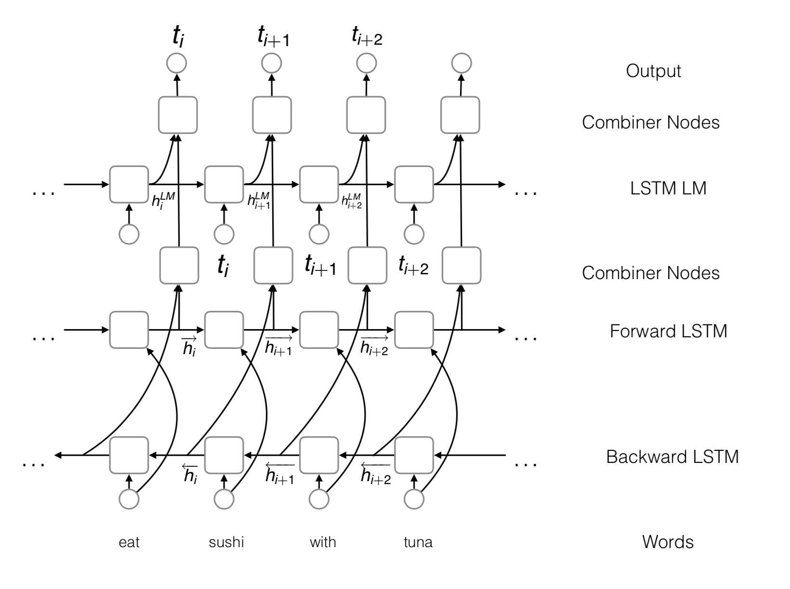

# CCGSupertagging

Implement a BiLSTM CCG Supertagging model.

### Motivation:

Add a language model to the LSTM Tagger.

### Model

*BiLSTM Model + LM on tags (Vaswani et al., 2016)*

### Result

| Model             | Dev Accuracy | Test Accuracy | Test F1(CCGBank) | Test F1(Wikipedia) | Test F1(Bioinfer) |
| ----------------- | ------------ | :-----------: | ---------------- | ------------------ | ----------------- |
| C&C(auto pos)     | 91.50        |     92.02     | 85.54            | 80.83              | 76.91             |
| NN                | 91.10        |     91.57     | 86.13            | 82.00              | 79.19             |
| RNN               | 93.07        |     93.00     | 87.07            | 82.49              | 79.14             |
| LSTM              | 94.10        |     94.30     | 87.20            | N.A.               | 80.50             |
| LSTM+tri-training | 94.90        |     94.70     | 88.10            | N.A.               | 82.20             |
| LSTM+LM           | 94.24        |       -       | 88.32            | -                  | -                 |

### References

1. Xu, W., Auli, M., & Clark, S. (2015). CCG supertagging with a recurrent neural network. In Proceedings of the 53rd Annual Meeting of the Association for Computational Linguistics and the 7th International Joint Conference on Natural Language Processing (Volume 2: Short Papers) (Vol. 2, pp. 250-255).

2. Vaswani, A., Bisk, Y., Sagae, K., & Musa, R. (2016). Supertagging with lstms. In Proceedings of the 2016 Conference of the North American Chapter of the Association for Computational Linguistics: Human Language Technologies (pp. 232-237).

3. Lewis, M., Lee, K., & Zettlemoyer, L. (2016). Lstm ccg parsing. In Proceedings of the 2016 Conference of the North American Chapter of the Association for Computational Linguistics: Human Language Technologies (pp. 221-231).

4. Lewis, M., & Steedman, M. (2014). Improved CCG parsing with semi-supervised supertagging. Transactions of the Association for Computational Linguistics, 2, 327-338.
